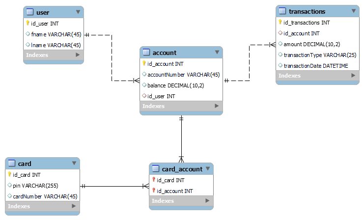

# Pankkiautomaattisimulaatio

## MySQL
Projektissa käytetään SQL-tietokantaa, johon pankkitiedot tallennetaan ja josta tietoja luetaan. Kuvassa 1 on esitetty tietokannan rakenne.

KUVA 1. ER-kaavio tietokannsta.
## Backend JavaScript REST API
JavaScriptillä luotiin REST API, joka toimii välikätenä SQL-tietokannan ja UI:n välillä. Tässä luotiin endpointteja jokaiselle HTTP-metodille, joita tarvittiin. Samassa yhteydessä toteutettiin myös salasanojen salaus.

## UI
UI tehtiin C++-kielellä, ja käytimme aikaisemmin luotuja HTTP-metodeja hakemaan tietoa tietokannasta ja näyttämään sitä käyttäjälle.

